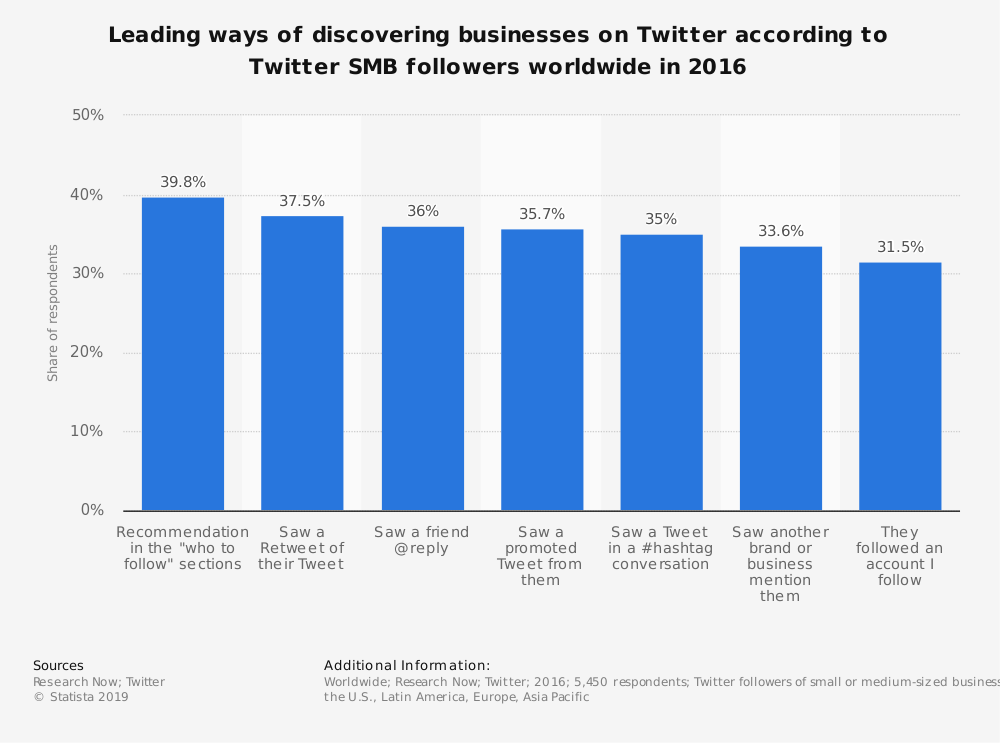

# BattleSheep

Smart Brand to Brand discovery (Idea is to discover brands that already have a social community overlap)

1. Celeb/Media tweets -> Named Entity Recognition (NER) -> Endorsed brand (Company) in their tweet -> Find people who retweeted that -> Use their tweets and find more brands. -> Go N level deeper with retweets with reducing weight -> Find brand discovery score with sentiment analysis.

2. Brand tweets -> Users who liked/retweeted -> NER for other brands in tweets.

You can contribute to this project by checking out the [Project page](https://github.com/users/tanaysh7/projects/1) and picking tasks in To Do List.

Data Source: twitter

Others:
- https://www.socialbakers.com/statistics/facebook/
- https://www.socialbakers.com/statistics/twitter/
